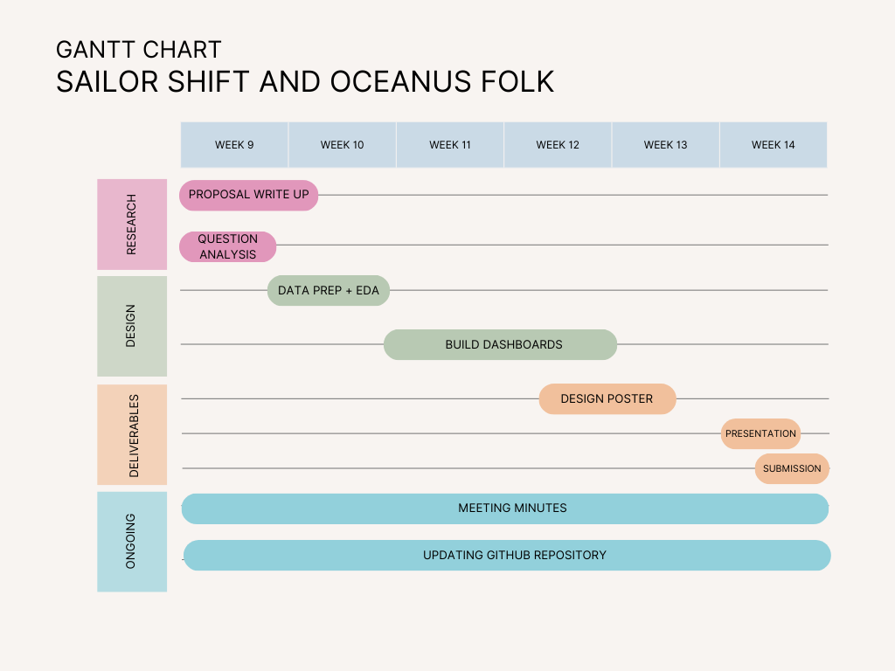

## Overview
Oceanus Folk is a music genre that gained global recognition largely due to the success of Oceanus artist Sailor Shift. Beginning her career in the early 2020s as a member of the all-female band Ivy Echoes, Sailor later pursued a solo career and achieved a major breakthrough in 2028 when one of her singles reached the top of the global charts. Since then, she has continued to grow in popularity while collaborating with artists across multiple genres.

As Sailor’s influence expanded, attention also grew around Oceanus Folk and its impact on the wider music ecosystem. To study this phenomenon, journalist Silas Reed compiled a knowledge graph dataset containing information about artists, albums, songs, collaborations, and musical influences.

However, the interconnected nature of this dataset makes it difficult to analyze using traditional methods. This project aims to develop an interactive visual analytics application using Tableau that allows Silas to explore Sailor Shift’s career, her collaborations, and the broader spread of Oceanus Folk within the music industry.

## Motivations
Influence in the music industry is shaped by complex relationships between artists, genres, and collaborations. These relationships often form interconnected networks that are difficult to interpret using static charts.

The rise of Oceanus Folk presents a compelling case of how a regional genre can gain global recognition. With Sailor Shift at the center of this transformation, understanding how influence spreads through collaborations and musical inspiration can provide insights into the evolution of the genre.

Visual analytics provides an effective approach for exploring such complex relationships by enabling interactive analysis of large interconnected datasets. Through interactive visualizations, Silas Reed will be able to investigate how Oceanus Folk evolved, how Sailor Shift influenced other artists, and how the genre continues to develop.

## Objectives
The objective of this project is to develop a Tableau-based visual analytics system that enables Silas Reed to explore the rise of Sailor Shift and the growing influence of Oceanus Folk within the global music landscape.
The system will support exploration of the following questions relevant to Silas Reed’s article Oceanus Folk: Then-and-Now:

- Who has influenced Sailor Shift over the course of her career
- Which artists she has collaborated with and who she has influenced in return
- How Oceanus Folk has spread across the broader music world
- Whether the influence of Oceanus Folk expanded gradually or through key breakthrough periods
- Which genres and artists have been most influenced by Oceanus Folk
- How Oceanus Folk itself has evolved with Sailor Shift’s rise
- What patterns characterize artists who emerge as rising stars in the music industry
- How the careers of selected artists compare in terms of popularity and influence

## Scope of Work
This project focuses on building an interactive Tableau application that allows exploration of the dataset compiled by Silas Reed.
The work will involve three main stages:

1. Data Preparation
The dataset will be examined and structured to support analysis of relationships between artists, songs, genres, collaborations, and influences.

2. Visualization Development
Interactive visualizations will be created to support exploration of artist influence, collaboration patterns, genre relationships, and artist career trajectories.

3. Insight Generation
The visualizations will be used to analyze patterns related to Sailor Shift’s career and the spread of Oceanus Folk, helping Silas Reed develop insights for his article Oceanus Folk: Then-and-Now.

## Timeline - Gnatt Chart
{fig-align="center"}